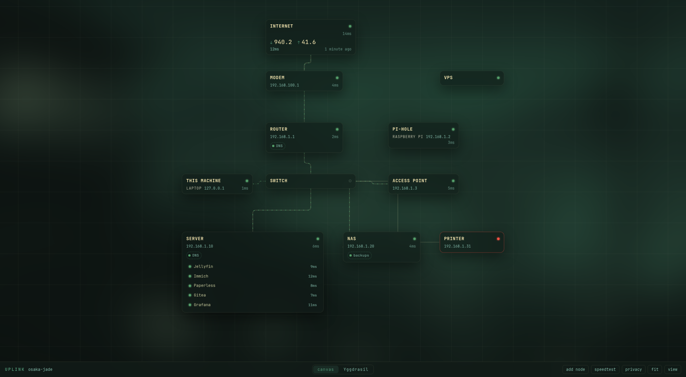
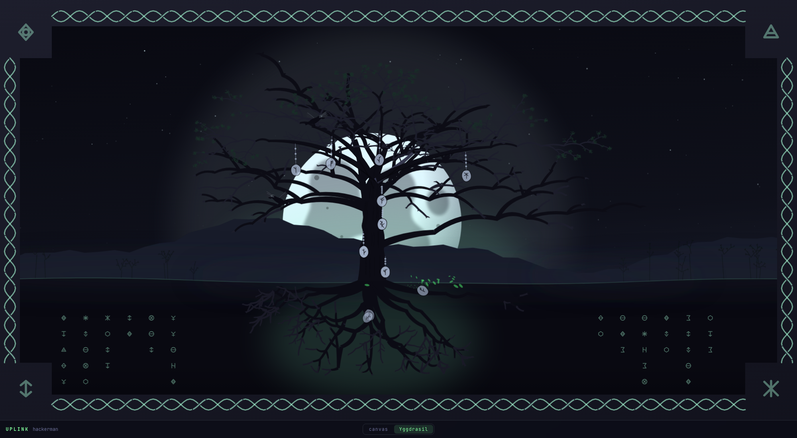

# Uplink

[](https://github.com/perfektnacht/uplink/actions/workflows/ci.yml)

A homelab dashboard shaped like the network it describes.

Most self-hosted dashboards are a grid of bookmark tiles with a YAML file
behind them. None of them know what your network *looks like*. Uplink draws the
thing you actually have — internet arriving, the modem, the router, Pi-hole
doing DNS off to one side, a switch, the box that runs everything — and puts
the links to your services inside the machine that serves them.

It runs on `127.0.0.1`, it repaints itself when you switch Omarchy themes, and
it has no login screen.





*An extended demo network, not anybody's real one. Colours come from the active Omarchy theme, so yours will not look like this.*

## Dependencies

Ruby 3.4 — what Omarchy ships — and Bundler. Everything else arrives with
`bundle install`: Rails 8 on SQLite, Solid Queue for the probes, Solid Cable
for the live updates, Solid Cache for the rest, and Hotwire, Propshaft and
importmaps for the front end.

No Node. No `package.json`, no `node_modules`, no build step, no bundler for
JavaScript. No Tailwind — every colour comes from your theme. No Redis, no
Postgres. One process, one unit file, four SQLite files in `storage/`.

There is a Dockerfile, and it changes none of that. It is there for a machine
where installing Ruby 3.4 is more trouble than it is worth, and what it runs is
the same one process on the same loopback address.

Omarchy itself is optional. Uplink runs anywhere Ruby does; without a staged
theme it falls back to its own palette and says so on the page.
`bin/uplink-install` is what wires it to the desktop, and it makes every
directory it needs rather than assuming one is there.

## Install

```bash
gem install --user-install bundler rails
git clone https://github.com/perfektnacht/uplink ~/Work/github.com/perfektnacht/uplink
cd ~/Work/github.com/perfektnacht/uplink
bundle install

bin/uplink-install                  # theme template, hooks, service, launcher
systemctl --user enable --now uplink
```

Then open it, or run `omarchy-launch-webapp http://localhost:3030`.

There is no database step because the service does it. Starting Uplink creates
the four SQLite files if they are not there, seeds the network from `ip route`
and your own dashboard's service list, migrates if a `git pull` brought a
migration, compiles the assets, and generates the `secret_key_base` Rails
insists on in production into `storage/` — the credentials in this repository
are encrypted with a key that is gitignored, so a clone has never had one and
should not have to go and make one before the app will start. Every one of
those steps does nothing on a start where there is nothing to do, which is what
makes upgrading `git pull` and `systemctl --user restart uplink`.

`bin/uplink-install --with-hyprland` also appends a marker-delimited window
rule to `~/.config/hypr/looknfeel.lua`. Without the flag it just prints the
line, because your Hyprland config is yours and an installer that edits it
behind your back is a bad guest.

Everything it touches lives under `~/.config`, `~/.local/share`, or
`~/.local/state`. Nothing goes in `/usr/share/omarchy`, which the omarchy
package owns and rewrites on update.

## Install with Docker

For a machine without Ruby 3.4 on it, or one where you would rather not put it.

```bash
git clone https://github.com/perfektnacht/uplink
cd uplink
docker compose up -d --build
```

Not under `sudo`, though, which is what you reach for before the docker group
has taken effect: sudo resets `HOME`, the compose file interpolates it into
both theme mounts, and they land on root's home where the container cannot
read them. `sudo HOME=$HOME docker compose up -d --build` carries your own home
through if you need the sudo.

That is the whole of it, and there is nothing to fill in first. The four
databases are created on the first boot, the network is seeded from your own
routing table, and the secret Rails insists on in production is generated into
the storage volume rather than out of you.

The container runs in the host's network namespace, which is not a way around
Docker's networking so much as the point of the exercise. Uplink has no login
because it binds to 127.0.0.1, and publishing a port would move that boundary
without moving the argument resting on it. Sharing the namespace keeps the
loopback the app binds to and the loopback you browse from the same address,
and three things follow. The app is no more reachable from the LAN than a
native install is. The theme hook's POST still arrives from 127.0.0.1, which
is the only credential that endpoint has. And a probe of your router measures
your router, rather than a bridge network Docker invented — which is what an
ICMP probe from inside one would otherwise be measuring. It also makes this
Linux-only, which is where Omarchy is anyway.

What that command costs, said plainly: `docker compose up -d --build` talks to
a daemon running as root, and anything able to talk to that socket can mount
your filesystem and become root with it. `sudo docker` and membership of the
`docker` group are the same amount of privilege — one asks for a password and
the other does not, and the one that does not is not the smaller of the two.

Uplink itself never runs as root in there. The image declares `USER 1000:1000`
and numbers the user to match the first human account on a Linux desktop, so
the storage volume and the read-only theme mounts line up without anything
having to be root to manage them. The daemon behind it is another matter, and
an app that argues this carefully about the boundary it rests on ought to say
so rather than let you find it out. The install above needs no root at all — a
user unit, user gems, a user service — which is why it is the one this file
leads with, and why the container is offered as the option for a machine you
would rather not put Ruby on rather than as the better way to run this.

Run `bin/uplink-install` from the clone as well, for the desktop half: the
theme template, the two hooks and the launcher. Then leave the systemd unit it
writes alone rather than enabling it — the container is already the service,
and two of them would race for port 3030 with one of them losing. Everything
else behaves as it does natively, including repainting an open tab when you
switch themes.

Afterwards:

```bash
docker compose logs -f          # what the probes are finding
docker compose up -d --build    # after a git pull
docker compose down             # stop it
docker compose down -v          # stop it and forget the network
```

Only the last of those deletes anything. Your network, the job queue, the
cache and the cable are all in the `storage` volume, which outlives every
rebuild — and the image itself carries none of them, because a layer
describing your LAN is a layer that could be pushed somewhere.

## Uninstall

```bash
bin/uplink-uninstall
```

Removes the service, the template, both hooks, the launcher, and the Hyprland
block if the installer added one. `storage/` is left alone — delete it if you
want the network forgotten too.

## No authentication, on purpose

There is no login, no 2FA, no OIDC, and that is a decision rather than a
shortcut. Uplink binds to loopback — enforced in `config/puma.rb`, not just in
the unit file — stores nothing but the shape of your own LAN, and every service
it shows is a hyperlink you could have typed yourself. A login screen would
protect a machine you are already sitting at from a person who is already you.

That argument only holds while the loopback boundary is real, so it is guarded
as one.

**The boundary.** Binding to 127.0.0.1 keeps other machines out but not other
websites: a page you visit can point its own domain at loopback with a
one-second TTL and fetch itself, and the same-origin policy will call the
answer that page's own. Uplink answers only to `localhost` and `127.0.0.1`, so
a request arriving under any other name is refused before it reaches a
controller.

**Writes.** CSRF protection stays on for everything that writes, because that
guards against a website you visit, not against you. `POST /theme/changed` is
the single exception — a shell hook with no session to carry a token — so what
stands in for one is where the request came from, read off the socket rather
than out of a header, because a header is something the caller writes. A
request carrying `X-Forwarded-For` is refused rather than read past: behind a
proxy the peer *is* the proxy, so trusting the socket alone would wave through
whatever the proxy fronts for.

**Links.** A service URL is printed into an `href`, so the schemes a browser
runs as code — `javascript:`, `data:`, `vbscript:` — are defused on the way in
and come back out as ordinary inert text. `ssh://`, `smb://` and `vnc://` are
left alone, because they are ordinary things to keep on a homelab dashboard.

**What is checked, and when.** Every push runs four jobs on GitHub Actions;
the badge at the top of this file is the last result. All four run locally too,
and none of them need anything that is not already in the Gemfile.

| Command | What it checks |
|---|---|
| `bin/rails test` | the suite, including every rule above |
| `bin/rails audit` | `Gemfile.lock` against the [ruby-advisory-db](https://github.com/rubysec/ruby-advisory-db) |
| `bin/rails brakeman` | the app's own code — the audit only covers what it depends on |
| `bin/rubocop` | Omakase Ruby styling |

One warning is on the ignore list, with a note in `config/brakeman.ignore`
saying why: the probe skips certificate verification, because homelab services
are full of self-signed certificates and refusing to talk to them would report
a working service as down. That is a worse lie than not checking the
certificate of a box on your own LAN — and the probe sends no credentials, so
what a man in the middle gains is the ability to claim a service is up.

The audit runs on every push rather than when somebody remembers, because a
known hole in something Uplink depends on is a hole in the whole of it — and an
app with no login has nothing else in front of it.

Two tests in `test/models/omarchy_test.rb` read the real desktop and skip where
there is not one, which is what a CI runner is. Everything else holds anywhere,
including a machine where `bin/uplink-install` has never run.

## Privacy

Everything the desktop decides arrives through one `<style>` element: the
palette Omarchy rendered, the font fontconfig reports, and the wallpaper the
canvas is washed with. Replacing that single node on a theme-set hook repaints
the whole app. The wallpaper is in there rather than in the stylesheet because
it is fetched by URL and so needs a version — and that version follows the
background *symlink* rather than the picture, since every background in a theme
is written when the theme is installed and they all share a timestamp. What
moves when you cycle wallpapers is which one the link points at.

`p`, or the toolbar button, paints over every address on the canvas so the
window can be screenshotted and posted somewhere public without anyone having
to blur it by hand. The text is redacted rather than blurred: a blur at this
size is guessable and still leaks the shape of a number, while a solid bar
leaks nothing — and keeping the original text underneath means no card changes
width, so the diagram looks identical either way. The setting is remembered per
browser.

It covers what is drawn. A service link still points at a real host, so the
status bar will show it if you screenshot mid-hover.

URL fields repair themselves as you use them. A paste undoes damage
immediately — whitespace, and a scheme that lost a slash — because that only
ever removes characters a URL cannot contain. Assuming `http://` for a
scheme-less address is a guess rather than a correction, so that waits until
you leave the field. The server applies both rules again on save.

URL fields are forgiving, and are plain text rather than `type="url"`. A field
that rejects `192.168.1.10:8080` for having no scheme is being pedantic about
a machine you can see from where you are sitting, so anything scheme-less gets
`http://`, surrounding whitespace is dropped, and `http:/host` — a scheme that
lost a slash, which is what a password manager rewriting the field as you type
can leave behind — is repaired. A `type="url"` input is also exactly what those
extensions read as a "website" field, so it is not one.

Every field in the inspector carries `data-1p-ignore`, `data-lpignore` and
`data-bwignore`, and its form is `autocomplete="off"`. Nothing here is a
credential, but a panel of text fields looks enough like a login that password
managers offer to save it as an identity.

Do not put this on the internet. It is not built for that and says so here so
you cannot say you were not told.

## Living inside Omarchy

This is the part that is not portable, and is the reason the app exists in this
shape.

Omarchy renders every template in `~/.config/omarchy/themed/*.tpl` into the
staged theme directory on each theme switch. Uplink ships one:

```
omarchy/uplink.css.tpl  →  ~/.local/state/omarchy/current/theme/uplink.css
```

So the app never parses a palette, never reads `colors.toml`, and does no color
math. It serves a CSS file the desktop already wrote, at `/theme.css`. Thirty-
odd custom properties, including `_rgb` variants for translucency and
`color-scheme` taken from the theme's own `mode` key — which is what lets the
stylesheet use `light-dark()` and get the shadows right on a light theme
without knowing which theme is active.

Then `omarchy-theme-set` fires its `theme-set` hook, and Uplink's hook is three
lines of curl. The app broadcasts a Turbo Stream replacing one `<style>`
element, and the browser refetches one small file. No reload, and your canvas
position survives.

Measured on the machine this was built on: the hook's POST returns in 10–40ms,
and `/theme.css` is 1845 bytes served in about 3ms. The repaint is the tail end
of a theme switch that takes ~570ms overall, so it lands while the wallpaper is
still crossfading.

The hook has a two-second timeout and swallows its own failures, so a stopped
Uplink can never slow down or noisily fail a theme switch. Measured: ~500ms
with the service down, ~570ms with it up.

A theme that ships its own `uplink.css` overrides the template entirely —
`omarchy-theme-set-templates` refuses to overwrite an output file that already
exists — so a theme author can art-direct Uplink without touching Uplink.

The desktop wallpaper is read through the same state directory and rendered
blurred behind the canvas, so Uplink sits in the same room as the rest of the
desktop rather than on a slab on top of it. Even the window icon is generated
per theme, from the accent colour Omarchy rendered — this runs as an Omarchy
web app, where the icon is the window.

## Probing

A node or a service is up if it answers, and the answer is one of three
questions: a TCP handshake, an HTTP request, or an ICMP echo borrowed from the
setuid `ping` already on the system.

The polling budget is the design constraint. Every row carries its own
`probe_interval` — sixty seconds by default — SQLite does the due-date
arithmetic in one indexed query, and a probe that changes nothing broadcasts
nothing. An idle dashboard sends zero frames and moves nothing beyond one small
query every fifteen seconds.

Pick `icmp` for anything you never log into. An adopted Unifi switch or access
point runs no web server at all — management lives in the controller — so a tcp
probe against one refuses forever, and the only port it answers is 22. A
refused connection is reported as "port N closed, host answered", because the
host sent back an RST: it is switched on and reachable, and the port number is
the only thing that is wrong.

Self-signed certificates are accepted, because refusing to talk to a homelab
box with its own cert would report a working service as down, which is a worse
lie than not checking.

A cable is drawn live when nothing along it is known to be broken — not when
both ends answered. An unmanaged switch answers nothing and never will; letting
that silence grey out the whole chain behind it would report ignorance as
failure.

## Speedtest

Measured against Cloudflare's `speed.cloudflare.com` endpoints, which are plain
HTTP with no client to install and no account to have.

The reading is kept on the Internet card, where the thing it measures is; the
button that takes it sits in the toolbar, because a control is not a fact.
It is manual by default. There is a commented entry in `config/recurring.yml`
if you want it nightly. A dashboard that quietly pulls thirty megabytes every
few minutes to draw you a number is measuring a problem it created.

## The canvas

Absolutely-positioned HTML cards over one SVG layer of cables — not a drawing
surface. That is the load-bearing decision: a service inside a node stays a
real `<a>`, so it is keyboard-reachable, middle-clickable into a new tab, and
themed by the same tokens as everything else. Nothing is reimplemented in a
canvas API.

Cables route orthogonally, leaving a card square-on and turning at right
angles, because that is how a rack diagram reads. Each is two paths: the base
carries the kind — coax is thick, wifi and logical are dashed, fiber is tinted
— and an overlay carries the drift that shows it is alive. Folded into one,
"live" would have had to own the dash pattern, and a coax run would have become
indistinguishable from a DNS relationship.

`logical` is for a link that is real but not physical. The router pointing at
Pi-hole for DNS travels over the same ethernet as everything else, and drawing
it as another wire would be a lie — so a Pi-hole usually wants both: an
`ethernet` cable to whatever switch it is plugged into, and a `logical` link
from the router that resolves through it.

A `logical` link is drawn as a chip on the card that depends on it, not as a
cable. The relationship is many-to-one — every machine on the network can point
at one Pi-hole — and a line from each of them would be noise rather than
information. The chip says whatever the link's label says: *DNS*, *VPN*, *NTP*.
Click one in edit mode to change it.

Note which way round that goes: the Raspberry Pi is the `host`, and Pi-hole is
a `service` running on it. Modelling it the other way makes a machine disappear
behind one of its own programs, and you lose the ability to see that the box is
up while the service on it is not.

A node's kind is free text, offered as suggestions rather than enforced as a
list. A closed enum kept failing real networks — a Pi-hole is not an appliance,
a Hue bridge is not one either — and every miss cost a migration.

Suggestions appear as chips under the field rather than in a `<datalist>`. A
datalist opens over the exact corner of the input where a password manager puts
its own icon, and the two fight for the same few pixels.

It is written out rather than drawn as an icon. Which glyphs exist depends on
whichever Nerd Font is currently set, and a router that renders as a plug is
worse than no icon at all.

| key | |
|---|---|
| `e` | toggle edit mode |
| `f` | fit everything on screen |
| `p` | privacy: redact every address |
| `Esc` | close the inspector |
| middle-drag, or drag the background | pan |
| ctrl + wheel | zoom toward the cursor |
| click a service (edit mode) | edit it; in view mode it opens the service |
| drag a card's `wire` handle onto another card | draw a cable |
| hold shift while dropping | make it a logical link |
| click a cable (edit mode) | change its kind or label, or delete it |

While you drag, a card looks for a neighbour it is nearly in line with and
locks onto it, drawing a guide to show what it caught. Centres outrank edges
even when an edge is closer: a cable leaves a card from the middle of a face,
so aligning centres is what makes the line straight, while aligning edges only
makes the layout tidy. Otherwise positions snap to an 8px grid, and save on drop. They live in the database
because you put them there; nothing is computed. The viewport, by contrast,
lives in `localStorage`, because where *you* are looking is not part of the
network.

## Yggdrasil

The same network, grown instead of drawn. Pick it from the bar at the bottom.

Nothing in it is new information — every branch, crown and raven is the graph in
`Node` and `Link` read a second way:

| You see | Because |
|---|---|
| The trunk | The `internet` node — the one place packets enter |
| A fork | A switch, router, modem or access point: gear that carries traffic rather than consuming it |
| A limb's thickness | The size of the subtree hanging off it |
| A leafy crown | A machine, server, NAS or hub that is answering |
| Leaves on the ground | A *service* inside that node is down — six leaves per dead service |
| A snapped limb, its crown lying under it | The node itself is down |
| Dead wood that still carries branches | A node that is down but has things behind it that are not |
| A root, and how thick it is | A node the network leans on with no cable to say so — DNS from the Pi-hole, NTP from the router — and how many things lean on it |
| A root that stops short, pale and dry | That node is down, and everything pointing at it is asking a machine that is not answering |
| A rune-disc hanging on a beaded cord | Something with a name, and something you can point at |
| The bind-rune burned into it | That node's own mark, from its id — the same one every render |
| An offering lying in the litter | That node is down, so its cord has come off the tree |
| An offering buried by a root | A dependency, down where the logical links are |
| A raven gripping a twig | An off-network node — no physical link — that is up. It wears no disc: the bird is already its marker |
| A raven on the ground, far from the tree, hunting | An off-network node that is down |
| The moon behind the trunk, sized by download speed | The last speedtest |
| A sun instead | Your Omarchy theme is a light one |
| An eclipse | The internet node is down |

Point at anything to read its name. Nothing else is clickable: Yggdrasil is
something you look at.

What tells you there is anything to point at is hung in the tree. Adam of
Bremen describes offerings hanging in the sacred grove at Uppsala, and the
Bryggen finds give the object: hundreds of small pieces of wood carrying runes,
a good many of them somebody saying which of it is theirs. A Norse label is a
tag tied to the thing it names, so every node wears one — a slice cut off a
branch, hung on a beaded cord, with a bind-rune burned into it.

The disc is built as a closed curve through jittered points rather than as an
ellipse, because nothing sawn off a tree comes out round. The mark is a stave
with two to four arms off it, which is what a bind-rune is: several runes
sharing one upright, the way a personal mark was made. Nothing in it runs
level — runic writing has no horizontal strokes, because cut that way they
follow the grain and split the wood. A raven wears none, because the bird is
already the most conspicuous thing in the picture and already marks exactly one
node; a disc hung beside it was a second marker for something that had one. There is one object rather than two,
because the wood already says whether a thing is infrastructure or a machine:
a bare fork or a leafy crown. An offering only has to say that there is a name
here.

They hang straight down. A thing on a cord has nothing holding it out to one
side, so the cord is vertical and the disc rests under its own knot — the swing
is the wind, and the wind is not a standing condition. What moves instead is
the knot: a cord looped over a limb sits on the wood's surface rather than
running out of the middle of it, so the tie goes to the edge, on whichever side
faces away from the trunk, and the disc hangs past the branch into open air.
Nodes standing on the trunk's own axis have no outward side, so those alternate.

The cords are all different lengths, which is what stops a chain of them
reading as buttons down a coat, and a pendulum's period goes with the square
root of its length — so the long ones swing slower than the short ones on their
own, and no two keep time. Drawing the durations at random would have looked
much the same and been a coincidence.

Motion is the only channel this picture has spare: it has one light and two
tones and no room for a third, but nothing in it moved except the sway. A disc
is also too small to work as a silhouette alone — it would vanish against the
night and again against the moon — so it is a light face over a dark contour,
which is the same trick the names use. Each one lives in the same group as the
name it belongs to, so pointing at the thing you can see is what reveals it.

Status stays in shape rather than colour. A living node's offering hangs; a
dead one's has come off and is lying in the litter with its leaves.

The picture hangs in a wooden frame with a plait carved down each rail — two
strands of the same sine a half period apart, so they cross at fixed points,
and at every other crossing one is drawn again on top, which is the whole of
what "interlaced" means. A sigil is cut into each corner block and a row of
them into the earth.

The tree is a silhouette: the light is behind it, so the wood is darker than
everything it stands in front of and bright only along the edge the light gets
past. How brightly that edge burns depends on how side-on the limb is and how
near the light it stands. Which colour counts as "darker than the sky" depends
on which way up the theme is, and the theme already says — it emits
`color-scheme`, so `light-dark()` settles it.

The light is one moon, low and behind the trunk, so the tree is lit from inside
its own frame rather than by a lamp in the corner. That makes the light a place
rather than a direction: a limb to the left of the trunk is lit from its right
and one to the right from its left, which is one dot product per limb and is
what backlighting looks like.

Two rules do most of the drawing. **Thickness follows load**, by Leonardo's
observation that the combined cross-section of a tree's branches equals the
trunk below them:

```ruby
radius_child = radius_parent * Math.sqrt(leaves_child / leaves_parent.to_f)
```

**Length follows divergence.** A switch carrying most of the network barely
turns, so it stays a short fat continuation of the trunk; the twig off to one
side reaches. Conflating the two questions is what turns a tree into a spire.

The network's own forks are only the first few. Past every tip the wood keeps
dividing on its own for seven more generations, and the roots do the same
underground — that recursion is what a tree actually is, and no amount of
shading on a bare stick stands in for it.

**This tree has no neighbours.** How much sky a limb gets is not the same
question as how much traffic it carries: a tree with competition divides the
light it can reach, and this one has none, so its sector is shared out much
closer to equally than its load is — thickness still follows the load exactly,
because that is the part that is information. Side branches alternate down each
chain rather than being tossed for, since enough coin flips going the same way
is the lopsided crown of a tree that spent its life leaning out from under
something else. And the crown sits high on a clear stem, because nothing here
is racing anything upward.

**Density is not uniform.** Filled evenly a canopy reads as one mass; emptied
evenly it reads as a sea urchin. A tree is neither, because the rule that
shapes it is not uniform: shade kills the twigs on the inside and light grows
the ones on the outside. So the branching gets busier the further from the
trunk it is, the pruning only touches the interior, and the internodes vary
widely in length — a canopy where every span is the same is a lattice.

**The width carries through, and the length follows the width.** Every twig is
the same kind of object as the trunk: a tapered outline that starts exactly as
wide as whatever it grew out of, and a piece of wood is about twelve times
longer than it is thick — which is what stops the ramification off a fat limb
coming out as a wedge rather than a branch. The last segment of every branch
comes to a point, because nothing in a tree ends square.
Nor does it fork evenly every time — usually one child carries on as the leader,
barely turning and barely thinning, while one or two side branches leave at a
real angle and much thinner; occasionally the leader is lost and two take over
together. That mixture is most of the difference between a tree and a bolt of
lightning. Because the width lives in the outline rather than in a stroke, the
four thousand twigs concatenate into two path elements.

Leaves hang on the twigs that exist rather than being painted as a mass over
them.

Every limb is a tapered outline rather than a stroke, so it can be wide where it
leaves the ground and thin where it ends. The shading is a dot product against
the direction of the orb, which is also where the light in the scene comes from,
so moving one moves the other. Branches arc upward along their length in
proportion to how horizontal they are, which is phototropism and is most of what
separates a tree that grew from a tree drawn with a ruler.

The scene is cached on everything it is drawn from — what each node is and how
it is, which services are inside it and how they are, what is cabled to what,
the reading the moon is sized by, and which way up the theme is. Growing the
tree costs about 60ms on a small network and four hundred on a large one, and
it is the same picture until one of those values moves, so the cost belongs to
the change rather than to the look: a repeat view is about 13ms. Deliberately
not keyed on `updated_at` — a probe stamps every node it visits whether or not
anything moved, and that would regrow the whole tree every sweep to arrive at
exactly the same picture.

The whole scene is one SVG and **no JavaScript at all**. Hovering a name is
`:hover`; the wind is `@keyframes`; a status change arrives as a Turbo Stream
that replaces the entire `<svg>`, because rendering it costs a few milliseconds
and a bare `<g>` inside a stream template parses as HTML rather than as SVG. The
palette is mixed out of the same theme tokens as the canvas, so switching an
Omarchy theme changes the season — bark, foliage, sky and stone at once, with no
reload, and a light theme hangs a sun where the moon was.

Only the frame, the range, the mist and the distant treeline are invented — and
the treeline is grown by the same recursion, then flattened into a single hazy
stroke, which is what distance does.

The earth is cut away below the ground line so the root plate is visible,
because that is the half of a tree nobody draws — and the half of a network
nobody draws is what it is standing in. A logical link is a real dependency
with no cable to carry it: the router asking Pi-hole for DNS travels over the
same ethernet as everything else, so it is not a branch. It is a root, as thick
as the number of things leaning on it, by the same rule as the limbs. The rest
of the plate is still invention, because a plate has to read as a plate on a
network with nothing logical in it at all — providers claim slots from the
middle out, heaviest first, and the roots either side of them do not move when
one appears. Buried wood is not blurred: a root is thinner than any blur worth
applying, so softening one erases it. It is a silhouette against the light
coming up through the soil, the same way the tree is a silhouette against the
sky.

Yggdrasil shows no addresses at all, so unlike the canvas it needs no privacy
mode.

## Development

```bash
bin/dev            # one process: server, jobs, and the recurring sweep
bin/rails test
```

Development runs the same job backend as production, because the jobs are the
feature — a dashboard that does not poll in development is one you cannot
develop.

The tests probe port 1 on loopback, which refuses instantly and always, rather
than stubbing the socket. A mock would only prove the mock was called.
